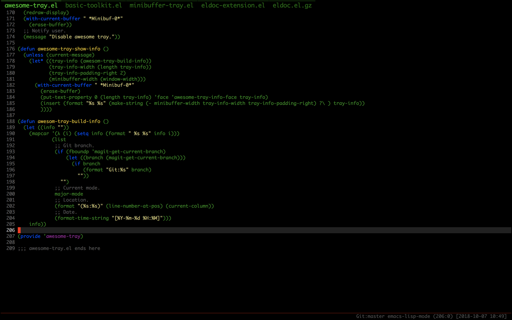

### What's this?
I don't like mode-line, it's too high, affect me to read the code.
With Emacs, we only need to focus on very little information, such as time, current mode, git branch.
Excessive information can seriously interfere with our attention.

## Installation
Clong this repository

```console
$ git clone --depth=1 https://github.com/manateelazycat/awesome-tray.git
```

Then put awesome-tray.el to your load-path.

The load-path is usually `~/elisp/`. It's set in your `~/.emacs` like this:

```Elisp
(add-to-list `load-path (expand-file-name "~/elisp"))
(require 'awesome-tray)
(awesome-tray-mode 1)
```

## Customize
You can controll modules through option ```awesome-tray-active-modules```.

You can find all modules name in the keys of variable ```awesome-tray-module-alist```. Currently we have:

- `awesome-tab`: Show group information of [awesome-tab](https://github.com/manateelazycat/awesome-tab).
- `buffer-name`: Show buffer name.
- `circe`: Show circe tracking buffer information.
- `date`: Show current date.
- `evil`: Show evil state.
- `file-path`: Show file path with full customizability. When the path is long, it can be shrinked into something like `.../.em/el/awesome-tray/awesome-tray.el`. See `awesome-tray-file-path-***` variables for details.
- `git`: Show current branch.
- `last-command`: Show last execute command.
- `location`: Show point position in buffer.
- `parent-dir`: Show direct parent directory.
- `mode-name`: Show major mode name.
- `rvm`: Show Ruby version information given by `rvm-prompt`.
- `battery`: Show battery status.

## Create a Module
Let's create a module that says hello to you. With a module you need:

- A name. Let's simply call it "hello".

- A info function that returns the string to be displayed. Here's a simple one

  ``` emacs-lisp
  (defun my-module-hello-info ()
    (concat "Hello " (user-login-name) "!"))
  ```

  A complex info function may encounter an error, awesome-tray will handle this and not show any information there.

- a face. Let's use a simple yet elegant italic style:

  ``` emacs-lisp
  (defface my-module-hello-face
    '((t (:italic t)))
    "Hello module face."
    :group 'awesome-tray)
  ```

- Awesome-tray uses `awesome-tray-module-alist` to find informations about a module. Let's put ours in it:

  ``` emacs-lisp
  (add-to-list 'awesome-tray-module-alist
             '("hello" . (my-module-hello-info my-module-hello-face)))
  ```

- Now put `"hello"` in the `awesome-tray-active-modules` list, and you will see awesome-tray say hello to you!

If you created a module that could be useful to others, please consider contributing it to awesome-tray!
